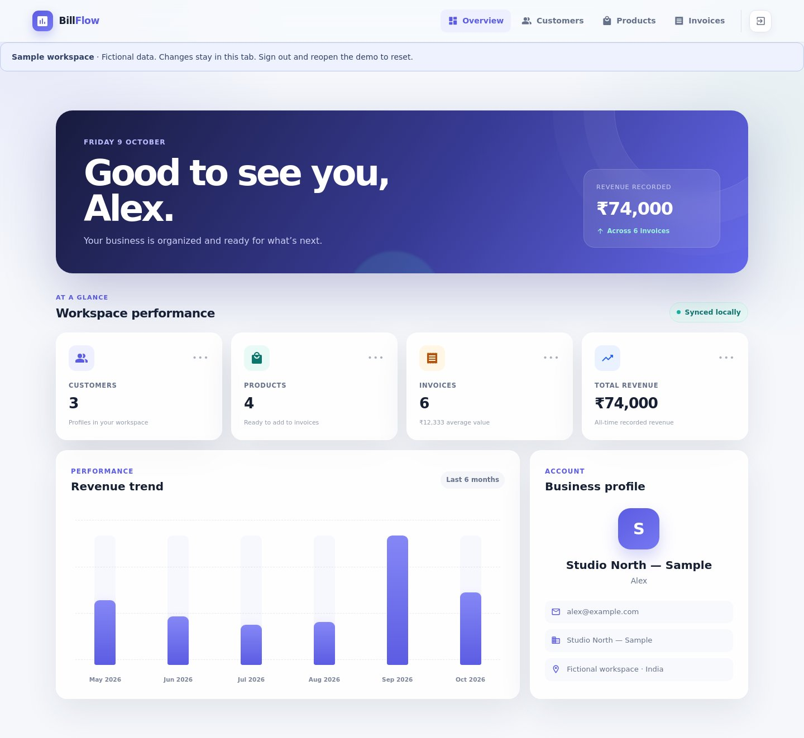
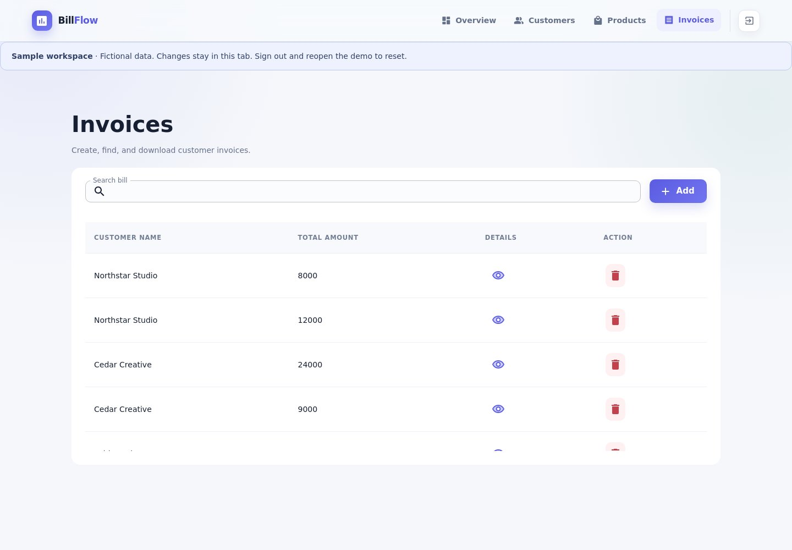
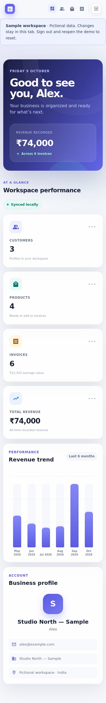

# BillFlow

**A frontend billing workspace built with React and Redux.**

Manage customers, maintain a product catalog, create invoices and inspect a six-month revenue view. A one-click sample workspace makes the project easy to explore without registration or an API server.

[Architecture & trade-offs](docs/ARCHITECTURE.md) · [Validation results](docs/VALIDATION.md) · [Quality workflow](.github/workflows/quality.yml) · [Deployment guide](docs/DEPLOYMENT.md)

## Interface preview

Actual screenshots from the local production build using fictional demo data.



<details>
<summary>Invoice workspace and mobile layout</summary>




</details>

## Explore in two minutes

1. Run the app locally using the commands below.
2. Choose **Explore live demo**. The app opens a fictional workspace with three customers, four products and six invoices.
3. Open **Customers**, **Products** and **Invoices**. Create an invoice and inspect its details.
4. Sign out and reopen the demo to reset the sample data.

Demo changes are isolated to the current browser tab's session. Existing local accounts remain separate. To explore persistence, create a local account instead.

## What this project demonstrates

| Area | Implementation |
| --- | --- |
| Application state | Redux reducers and async thunks across customer, product and invoice workflows |
| Forms | Formik/Yup validation and Material UI controls |
| Billing rules | Price snapshots, valid quantities and protection against deleting referenced records |
| Dashboard | Workspace totals and month-based revenue aggregation |
| Demo experience | Signup-free fictional workspace isolated from persistent account data |
| Local persistence | Encrypted workspace payloads with browser-local accounts |

## Run locally

Use **Node 22** and **Yarn 1.22.22**.

```bash
npm install --global yarn@1.22.22
yarn install --frozen-lockfile
# macOS / Linux: required by the existing Webpack 4 toolchain
NODE_OPTIONS=--openssl-legacy-provider yarn start
```

Open `http://localhost:3000`. On PowerShell, set `$env:NODE_OPTIONS="--openssl-legacy-provider"` before `yarn start`.

## Quality checks

```bash
yarn test --watchAll=false --runInBand
NODE_OPTIONS=--openssl-legacy-provider yarn build
```

The GitHub Actions workflow runs tests and a production build on pull requests and pushes to `master`. Tests cover reducers, monthly aggregation, encrypted storage, demo isolation/reset, invoice price snapshots, deletion constraints, invalid quantities and expired sessions.

## Scope and limitations

This is a **personal frontend portfolio project**, not a production accounting product. It has no server-side identity, collaboration, payments or multi-device sync. Account profile metadata is stored locally in plaintext; workspace records are encrypted. Clearing browser data removes local accounts. Never use real financial or customer data in the demo.

The project retains React 17, Material UI 4 and React Scripts 4. Modernization, transactional writes, integer minor-unit currency calculations and broader browser/accessibility testing remain future work. PDF export depends on Kendo React PDF and its licensing requirements.

See [architecture](docs/ARCHITECTURE.md) for the data flow, implementation decisions and production boundaries. No performance score or production-readiness claim is implied.
