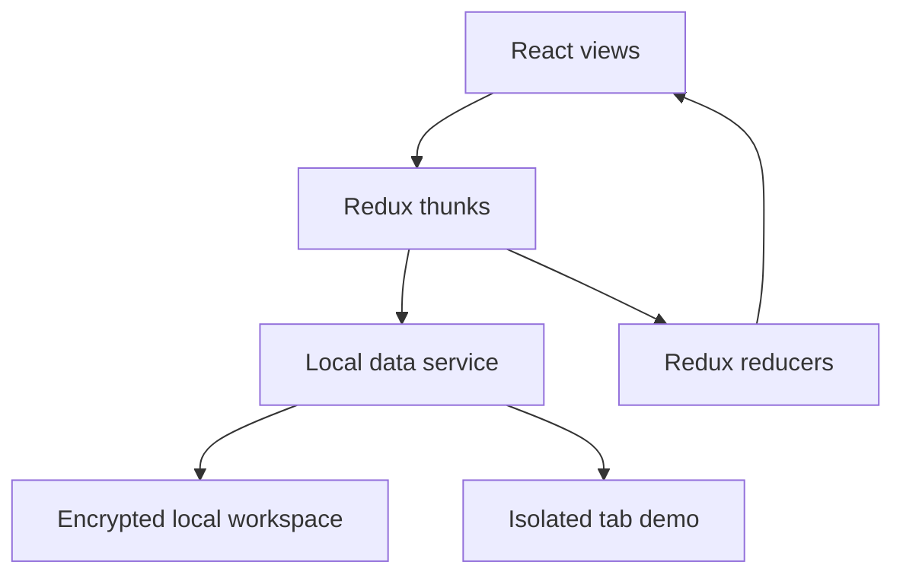

# Architecture and trade-offs

BillFlow is a React 17 portfolio application. It demonstrates customer, catalog and invoice workflows without requiring a backend account or API key.

## Boundaries

- `src/components`: screens, forms, navigation and invoice presentation.
- `src/Redux`: actions coordinate data operations; reducers project results into UI state.
- `src/data/localData.js`: account lifecycle, storage, entity validation and invoice rules.
- `src/data/demoWorkspace.js`: fictional records and six months of sample invoices.
- `src/utils/billing.js`: month-based aggregation for the dashboard.

## Why an isolated demo?

Visitors can inspect a populated workflow with one click. The demo database and its encryption key live in sessionStorage. Existing local accounts use localStorage and are not overwritten by demo edits. Signing out removes demo records; opening the demo again creates fresh samples. Reloading the tab preserves the current demo until its session expires. Browser session restoration may preserve sessionStorage; it is not a secure deletion guarantee.

The entry point reloads into `/admin` after creating the demo so it reuses the app's existing session/Redux hydration. This adds a navigation reload but avoids a second authentication state path. A persistent notice distinguishes sample data from user data.

## Domain rules

An invoice references an existing customer and product. Quantities must be integers between 1 and 10,000. Each line stores a price snapshot; later catalog price changes do not recalculate issued invoices. Customers and products used by invoices cannot be deleted until their referencing invoices are removed.

## Local storage is a deliberate limitation

Normal workspaces use AES-GCM encryption with a password-derived key and an eight-hour tab session. Account profile metadata remains readable in localStorage. Client-side encryption does not provide server-side authorization or protect a compromised browser. There is no multi-device sync, password recovery, team access, tax compliance or payment collection.

All writes use a read/modify/write storage operation. Concurrent tabs or overlapping writes can conflict. A production system should use authenticated APIs, transactional persistence, explicit authorization, audit history and integer minor-unit money arithmetic. Those are future changes, not implemented features.

## Toolchain

The existing React Scripts 4 / Webpack 4 toolchain is retained to keep this increment focused. Node 22 requires `--openssl-legacy-provider` for that build tooling. The PostCSS dependency used by the safe parser is pinned to 8.4.49 to resolve a package-exports build failure on modern Node versions. A separate migration should replace the legacy build chain and review dependency support. PDF export uses Kendo React PDF; review its license before distribution or commercial use.
