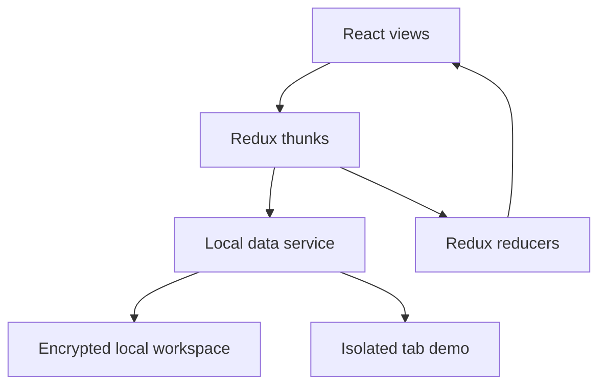

# Architecture and trade-offs

BillFlow is a React 17 portfolio application. It demonstrates customer, catalog and invoice workflows without requiring a backend account or API key.

## Boundaries

- `src/components`: screens, forms, navigation and invoice presentation.
- `src/Redux`: actions coordinate data operations; reducers project results into UI state.
- `src/data/localData.js`: account lifecycle, storage, entity validation and invoice rules.
- `src/data/demoWorkspace.js`: fictional records and six months of sample invoices.
- `src/utils/billing.js`: month-based aggregation for the dashboard.

## Why an isolated demo?

Visitors can inspect a populated workflow with one click. The demo database and its encryption key live in sessionStorage. Existing local accounts use localStorage and are not overwritten by demo edits. Signing out removes demo records; opening the demo again creates fresh samples. Reloading the tab preserves the current demo until its session expires. Browser session restoration may preserve sessionStorage; it is not a secure deletion guarantee.

The entry point reloads into `/admin` after creating the demo so it reuses the app's existing session/Redux hydration. This adds a navigation reload but avoids a second authentication state path. A persistent notice distinguishes sample data from user data.

## Domain rules

An invoice references an existing customer and product. Quantities must be integers between 1 and 10,000. Each line stores a price snapshot; later catalog price changes do not recalculate issued invoices. Customers and products used by invoices cannot be deleted until their referencing invoices are removed.

## Local storage is a deliberate limitation

Normal workspaces use AES-GCM encryption with a password-derived key and an eight-hour tab session. Account profile metadata remains readable in localStorage. Client-side encryption does not provide server-side authorization or protect a compromised browser. There is no multi-device sync, password recovery, team access, tax compliance or payment collection.

All writes use a read/modify/write storage operation. Concurrent tabs or overlapping writes can conflict. A production system should use authenticated APIs, transactional persistence, explicit authorization, audit history and integer minor-unit money arithmetic. Those are future changes, not implemented features.

## Invoice preparation lifecycle

`invoiceDrafts` is an optional encrypted workspace collection. Older accounts/backups without it open as an empty collection. Drafts contain only whitelisted editable fields, IDs, bounded item values, timestamps and a monotonically increasing revision; incomplete fields are allowed. Drafts are not bills, do not allocate financial-year numbers and are excluded from reporting/receivables. Backups include drafts and permit missing references so recoverable work is not silently discarded; the editor requires replacement before saving/issuing unavailable items.

Draft updates/deletes/duplication check the supplied revision inside the existing queued mutation. Issuance checks that revision, validates the final invoice, allocates the number, writes the invoice and consumes the draft in one encrypted workspace write. `sourceDraftId` on the issued invoice makes retries idempotent, and the Redux reducer deduplicates the same invoice ID. A failed write changes neither persisted numbering nor the draft. This is browser-local concurrency protection, not multi-user server authorization; cross-tab guarantees depend on Web Locks support.

Catalog prices are not locked by a draft. Resuming refreshes prices with an explicit warning; issuance rejects an editor price that no longer matches the catalog. No stock reservation, inventory movement, background autosave or automatic document delivery is implemented.

`quotations` and `invoiceTemplates` are optional encrypted collections (200 records each; 100 items per record), defaulting to empty for older accounts. Quotations require complete customer/address/date/item/tax details and snapshot party details and quoted prices at creation. A separate bounded quotation counter supplies `QT` references without touching invoice numbering. Only open, unexpired quotations may transition to manually accepted/rejected with an expected revision. Accepted, unexpired offers convert through `addBill`: caller-provided customer/items/prices are ignored in favour of stored quotation values. Conversion validates available references and schedule, allocates an invoice number, preserves the party/price snapshots and marks the quotation converted in one encrypted write. `sourceQuotationId` provides retry idempotency even after expiry or conversion. The original offer is retained; status decisions and conversion are not reversible through this workflow.

Templates whitelist item bundles and notes only. Creating a draft revalidates products and quantities, refreshes catalog prices, applies current supplier defaults, and clears customer details/due date/identifiers. Template deletion never removes derived drafts or issued records. Backup opening checks collection bounds, IDs/revisions, quotation values, reference-number uniqueness and converted-invoice links; historical quoted prices are retained rather than replaced by current catalog prices. Native quotation printing uses scoped print styles; it is distinct from invoice PDF generation and requires target-browser print-preview checks. Neither manual acceptance nor browser-local revision checks are proof of remote approval or server authorization.

## Cross-page operational records

`stockRecords` stores one counted balance per product, a fixed tracked unit, reorder level, revision and an append-only movement history. Opening counts precede all adjustments; threshold-only events have zero delta. Queued mutations verify the expected revision and current catalog unit, enforce whole-unit non-negative balances, and persist balance/history together. Invoices never call the stock mutation. Products with tracked history cannot be removed. The limits (1,000 records; 200 movements each) fail explicitly without pruning data.

`followUps` stores customer references/saved names, date, priority, channel, purpose, preparation notes and bounded activity history. Editing open tasks and completing/reopening tasks requires the expected revision; outcomes/reopen reasons are required. Completed tasks are retained. Shared desks in Customers, customer accounts and Collections use the same encrypted records; Overview previews open priorities. A same-document change event refreshes mounted desks after successful UI saves, not before persistence. No external messages or scheduler actions are performed. Limits are 500 tasks and 100 events each.

Backup validation checks operational collection bounds, references/IDs, history/revision alignment, stock balances reconstructed from movements and task status consistent with the latest event. Older missing collections become empty. Settings reports backup coverage rather than claiming successful recovery. Catalog-quality filters use a pure metadata review helper; they do not imply tax compliance or inventory valuation.

## Presentation contracts

`WorkspaceDialog` owns the responsive width and viewport gutters. Callers choose `compact` (440px) for decisions, `standard` (600px) for search/messages, `operations` (640px) for stock/follow-up forms, `document` (760px) for accounts/invoices, `editor` (920px) for customer/catalog studios, or `invoice` (960px) for the sectioned composer with its live review panel. Children fill their containers without viewport-based minimum widths. `Popup` provides an accessible dialog title, busy-state close blocking and dirty-state confirmation; sizing changes must not bypass these safeguards.

`src/index.css` contains the shared surface, typography and motion rules. Its screen-only premium density contract caps operational canvases at `--workspace-width` (1,104px), settings at 880px and documents at 960px. Search inputs are bounded rather than stretched; headers, metrics and operations share restrained surfaces and consistent spacing. New UI must follow this contract, not introduce viewport-wide forms or competing page widths. Brief arrival and interaction animations respect `prefers-reduced-motion`; financial PDF styles remain separate from interactive editor styles. See the README's interface standards for the visual review checklist.

Outlined-input notch legends are excluded from the dialog's inherited `overflow-wrap:anywhere`. Their hidden spans use `white-space:nowrap` and normal word breaking: a collapsed legend can otherwise wrap every character and contribute hundreds of pixels of invisible scroll overflow. Keep the exception scoped to input legends so real content still wraps, and review short/long dialogs at the end of their scroll range. Dialogs must remain content-sized, not fixed-height or overflow-clipped.

Outlined visible labels use separate width caps for resting and 0.75-scale floating states. Truncation is visual only, preserving the label association and accessible name. Scope compact filter sizing to the stock desk rather than shrinking every trailing search field; mobile filters return to full width.

`controls/ActionButton` renders a native button through Material UI IconButton, with the caller's accessible name and tooltip. Shared theme-token surfaces replace hard-coded pastel tiles; destructive tone is separate from edit emphasis. Header sign-out remains a separate native button with a decorative line icon. Both styles retain keyboard focus, coarse-pointer targets and global reduced-motion handling; handlers and deletion guards are unchanged.

## Appearance

`AppearanceProvider` owns light/dark selection and the Material UI theme from `createAppTheme`. It uses a separate, non-sensitive local preference (`billflow.appearance`), follows OS changes only before a manual override, tolerates storage failures, and listens for preference changes from other tabs. `data-theme` on the document root scopes screen-only custom styles; document previews and print rules retain the light document palette. `ThemeToggle` is available in public and signed-in headers. New components must use palette/surface tokens or provide explicit dark styles rather than hard-coded light-only surfaces.

## Toolchain

The app uses React Scripts 5 / Webpack 5 on Node 22 or 24. `craco.config.js` replaces CRA's deprecated development-server hooks with `setupMiddlewares`, preserving the error overlay, public-path redirect, proxy setup and service-worker reset. It also skips the incomplete source maps shipped by Kendo PDF 4; application and other dependency source maps stay enabled. No OpenSSL compatibility flag is required. The PostCSS safe-parser dependency remains pinned to 8.4.49. PDF export uses Kendo React PDF; review its license before distribution or commercial use.
